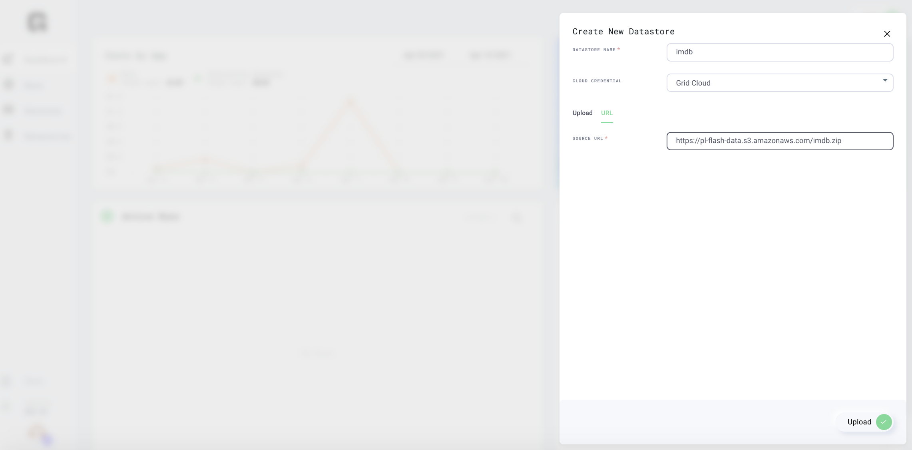
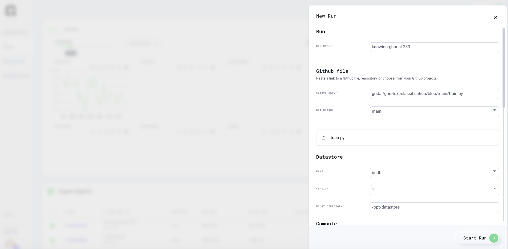
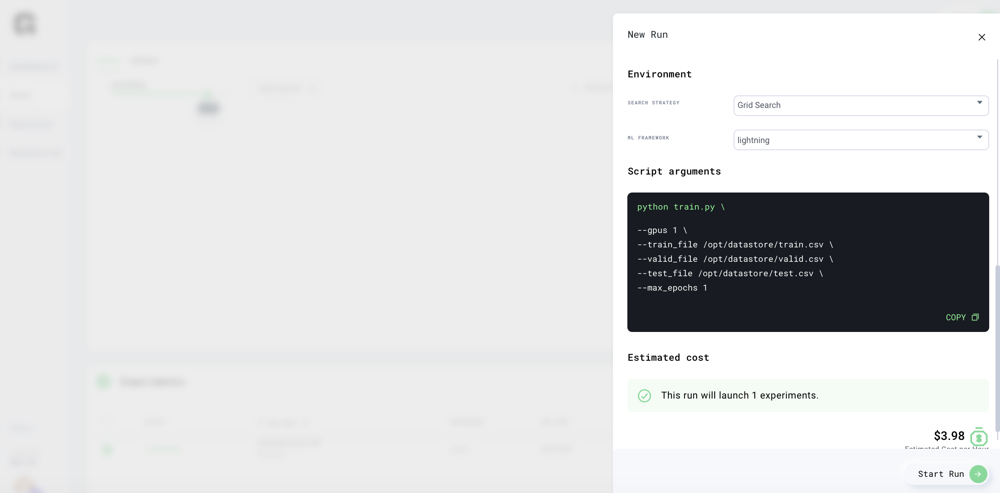
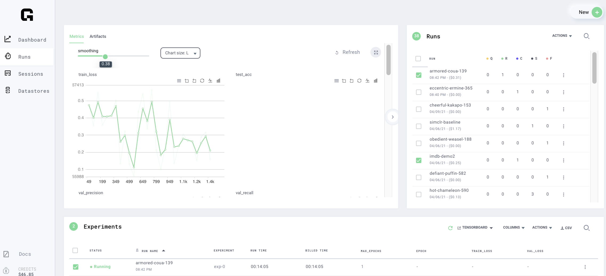
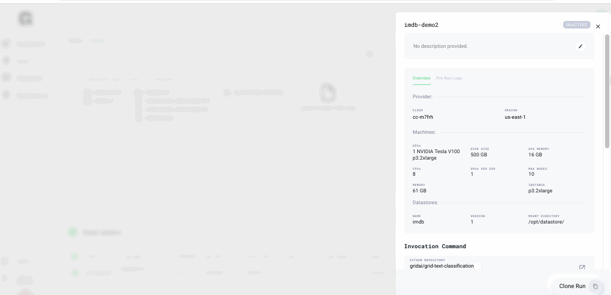

# Text Classification

## Goal

This example covers a text classification deep learning task

1. Create a Datastore
2. Start new Run
3. Visualize Metrics
4. Download Artifacts

Tutorial time: 5 minutes

## Overview

Classifying text is a deep learning task that represents a class of problems such as sentiment analysis: predicting the sentiment of tweets and movie reviews or customer sentiment regarding a product as well as classifying email as spam or not.

This example uses the Transformers model \(bert-base-uncased\) from [huggingface repository](https://huggingface.co/bert-base-uncased), it is adapted to use PyTorch Lightning, [https://github.com/gridai/grid-text-classification](https://github.com/gridai/grid-text-classification) and [Lightning Flash](https://github.com/PyTorchLightning/lightning-flash)

### **IMDB Dataset**

IMDB dataset contains movie reviews, it is used for natural language processing, text analytics or sentiment classification such as positive or negative sentiment based on the text in the review. This dataset was originally created for [this paper](https://www.aclweb.org/anthology/P11-1015.pdf)

### **Model \(BERT\)**

BERT\([Bidirectional Encoder Representations from Transformers](https://arxiv.org/abs/1810.04805)\) is a popular architecture used in NLP tasks. It works by applying bidirectional training of Transformer, a popular attention model, to language modeling.

## Step 1: Create Datastore

It is fastest to upload zipped datasets from the Web UI.

```text
https://pl-flash-data.s3.amazonaws.com/imdb.zip
```



## Step 2: Start a new Run

Take a look at this file if you are curious about the model. [https://github.com/gridai/grid-text-classification/blob/main/train.py](https://github.com/gridai/grid-text-classification/blob/main/train.py)

Paste the link to file in the New Run page.

Make sure to select the datastore created above. Notice that mount directory is /opt/datastore. Make sure to add the flags to your script.



Add flags to the script then Run



## Step 3: Visualize Metrics

As the model starts to train, metrics appear in the metrics section, make sure to select the Experiments to see metrics.

Tensorboard is also accessible



## Step 4: Download Artifacts

Artifacts are available to download as well. You can choose to train for many epochs, create multiple checkpoints.



## Bonus: Run in CLI

If you prefer to use CLI, use this command below

```bash
git clone https://github.com/gridai/grid-text-classification.git
cd grid-text-classification
```

```bash
grid run \
    --gpus 1 \
    --instance_type 1_v100_16gb \
    --datastore_name imdb-ds \
      train.py \
    --gpus 1  \
    --train_file /opt/datastore/train.csv \
    --valid_file /opt/datastore/valid.csv  \
    --test_file /opt/datastore/test.csv \
    --max_epochs 1
```

