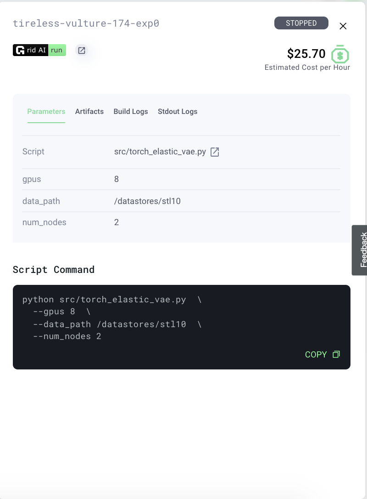

# Multi-node training

Multi-node or distributed training allows you to train a single model across more than one machine.

Early access to multi-node is now available, send us a message on community slack: gridai-community.slack.com or email at support@grid.ai with feedback

We are continuing to improve this beta feature feedback is greatly appreciated. Grid support for distributed training is for Torch-based frameworks only at this time. If 4 GPUs are requested, then 4 images with 2 CPUs and 1 GPU each will run in a distributed manner.

## Using CLI

Starting a multi node run in CLI is the same as how you run any other script, Grid calculates number of gpus and nodes for you. simply specify how many GPUs you will use per experiment. 

For example --gpus 5 --instance\_type 4\_v100\_32gb will automatically trigger multi node training

Example of 1 node 4 GPUs :

```bash
grid run --instance_type 4_v100_16gb --framework lightning --gpus 4 torch_elastic_vae.py --data_path grid:stl10:1 
```

Example of 2 nodes 8 GPUs:

```bash
grid run --instance_type 4_v100_16gb --framework lightning --gpus 8 torch_elastic_vae.py --data_path grid:stl10:1
```


## Step 0: Start a Run using Web UI

Start a new run

Paste the Github script in Run dialog as you would normally

Select the machine and specify GPUs per experiment


## Step 1: Visualize Results

In the same way as you would for a single node run. If tensorboard logs are available, scalars will be visible and artifacts such as checkpoints and configurations can be downloaded

Verify how many GPUs were run in the Experiment Details



