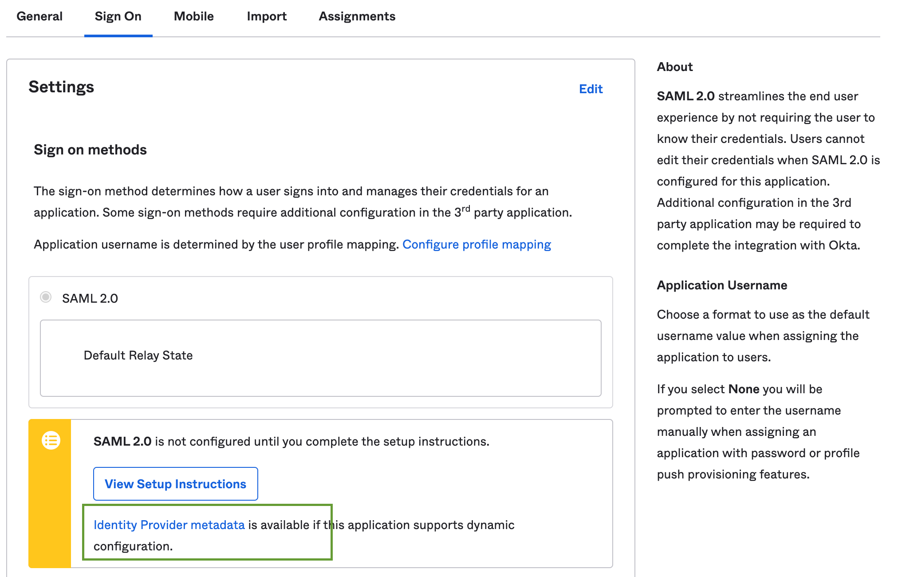
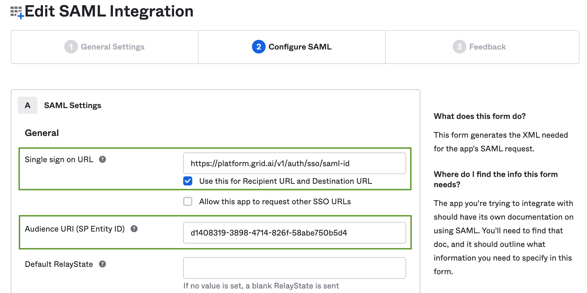

# Single Sign-On \(SSO\)

## Prerequisites

Please contact Grid support with your SAML identity provider details. Details that we require:

* Your SAML metadata endpoint
* Domain names used by your organization \(e.g. `grid.ai`\)

Below you can find instructions on how to setup [Okta](https://www.okta.com/) authentication with Grid. Other SAML providers are also supported, however you will need to know where to get and set several settings.


Interested in using another SSO / SAML provider? Reach out to use at [support@grid.ai](mailto:support@grid.ai) and we'll write specific instructions.


## Okta

### Step 1: **Providing Grid support with your SAML metadata and email address**

First, create an Okta application and assign users to it. These are users that will be available to login to Grid.

Then, once the application is created, provide us the metadata URL. You can find it by visiting "Sign On" tab and clicking on **Identity Provider** metadata:

Provide Grid support with this metadata URL and the domain names used by your users. For instance, if you users have emails like `support@grid.ai` then you'll send us the domain name `grid.ai`. This will configure the integration to respond to users with email `grid.ai`.

### Step 2: Adding Grid details to your Okta application

Grid support will give you two pieces of information:

* Your "Audience URI \(SP Entity ID\)", similar to `https://platform.grid.ai/v1/auth/sso/`**`saml-id`**
* Your "Single sign on URL", similar to `d1408319-3898-4714-826f-58abe750b5d4`

Edit your SSO application and set these details:

Done! Now you can visit the [https://platform.grid.ai](https://platform.grid.ai) and use your organization's email address to login.

