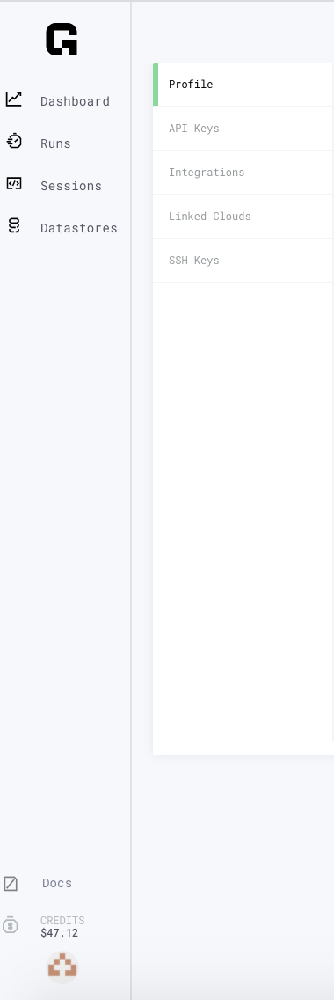

# Viewing Login Credentials

## Settings

Your login credentials, API key, SSH keys can be found on the Settings page.

Click on your profile icon in the navigation bar and select **Settings**. You can add an SSH key as well as grant access to Github repositories using this page.

